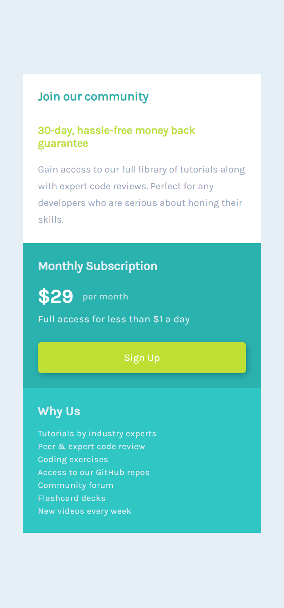
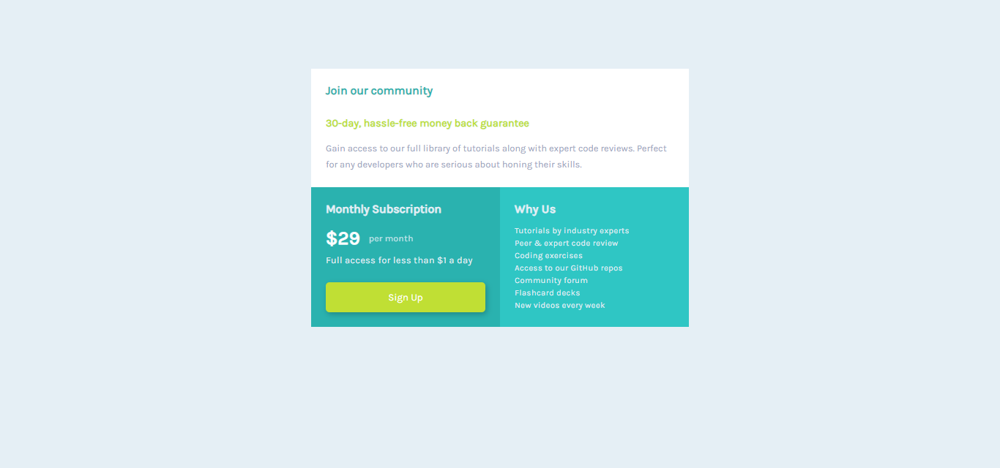

# Frontend Mentor - Single price grid component solution

This is a solution to the [Single price grid component challenge on Frontend Mentor](https://www.frontendmentor.io/challenges/single-price-grid-component-5ce41129d0ff452fec5abbbc). Frontend Mentor challenges help you improve your coding skills by building realistic projects. 

## Table of contents

- [Overview](#overview)
  - [The challenge](#the-challenge)
  - [Screenshot](#screenshot)
  - [Links](#links)
- [My process](#my-process)
  - [Built with](#built-with)
  - [What I learned](#what-i-learned)
  - [Continued development](#continued-development)
- [Author](#author)

## Overview

### The challenge

Users should be able to:

- View the optimal layout for the component depending on their device's screen size
- See a hover state on desktop for the Sign Up call-to-action

### Screenshot

### Links

- Solution URL: [Add solution URL here](https://your-solution-url.com)
- Live Site URL: [Add live site URL here](https://your-live-site-url.com)

## My process

For this challenge I examined the design picture given to thing about the best html structure to use to easily facilite being responsive with as little code as possible.  I started with a mobile-first workflow and figured out the spacing to get as close to the design picture as possible.  Once I figured out to set a max-height on the the mobile view it was fairly simple to switch the flex direction to row to incorporate the desktop design.  In the picture it seemed as if the elements all stayed the same size, so I had to preserve their dimensions as much as possible.  Instead of using regular CSS, I practiced using SASS.

### Built with

- Semantic HTML5 markup
- CSS custom properties
- Flexbox
- Mobile-first workflow

### What I learned

I learned that if you properly set up your html structure setting up media queries to switch to a desktop layout can pretty simple.  I also learned to use max-height to control an element from stretching along with the screen size.

### Continued development

I want to continue focusing on media queries and responsive design as well as CSS Flexbox and Grid to better understand when to use which technique.  II also want to continue to get more comfortable using SASS instead of CSS3.

## Author

- Frontend Mentor - [@njohnson533](https://www.frontendmentor.io/profile/njohnson533)
- Twitter - [@artsycoder533](https://www.twitter.com/artsycoder533)

